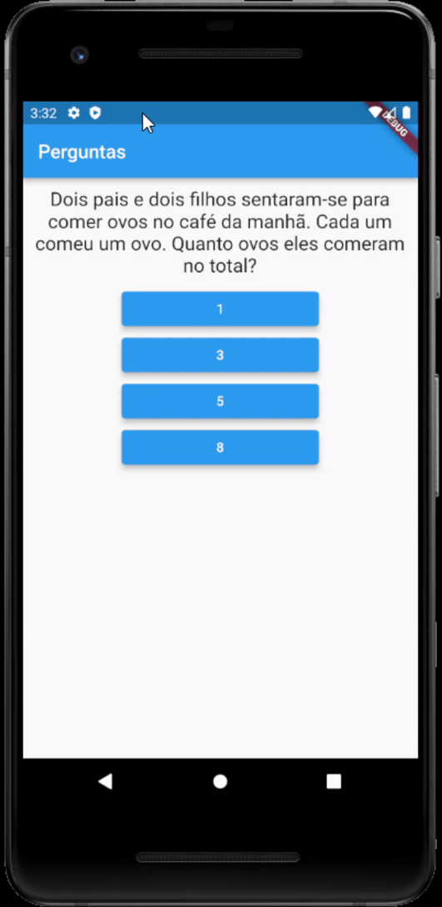

[![LinkedIn][linkedin-shield]][linkedin-url]

<!-- PROJECT LOGO -->
 

  

  <h3 align="center">Quiz App</h3>

  
This is a simple Quiz App made with Flutter

<!-- ABOUT THE PROJECT -->
## About The Project

 
The idea behind this repository is to explore the framework Flutter and improve my development skill, building a simple app.

 

### Built With

* [Flutter](https://flutter.dev/)

<!-- LICENSE -->
## License

Distributed under the MIT License. See `LICENSE` for more information.

<!-- CONTACT -->
## Contact

Victor Henzzo - victorhenzzowp@gmail.com

<!-- MARKDOWN LINKS & IMAGES -->
[linkedin-shield]: https://img.shields.io/badge/-LinkedIn-black.svg?style=for-the-badge&logo=linkedin&colorB=555
[linkedin-url]: https://www.linkedin.com/in/victorhenzzo/
[product-screenshot]: product.gif